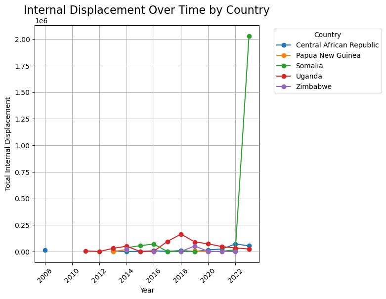
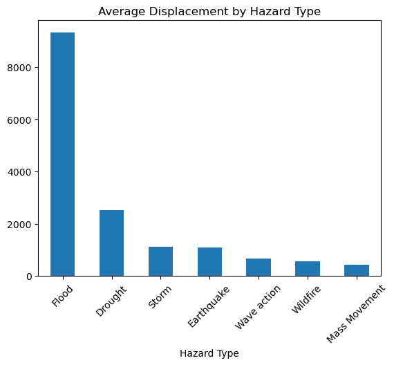
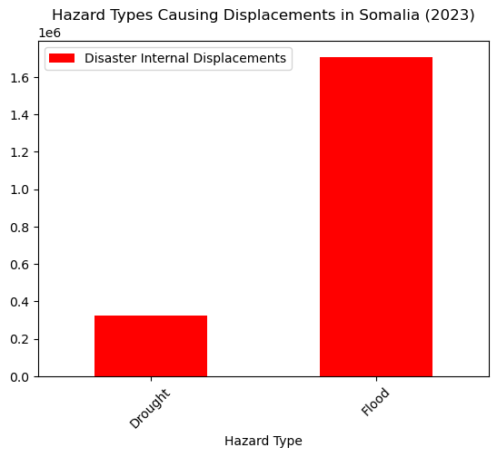
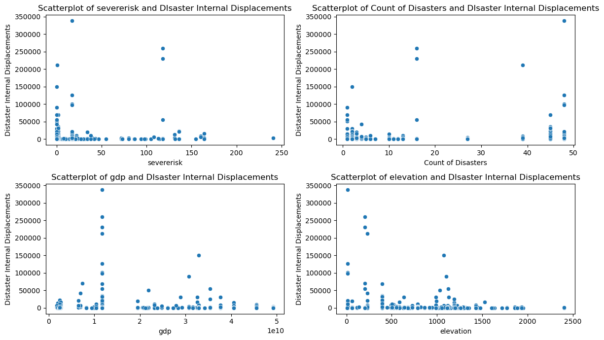

# Disaster Displacement Analysis
This project analyses patterns and trends in disaster-induced internal displacement, uncovering factors that influence population movements across five countries.
## Dataset Description
The dataset contains annual records for five countries, including:
- Country
- Year
- Displacement Count
- Hazard Type
- GDP
- Severe Risk
- Count of Disasters
- Elevation,
- Etc.
## Methodology
The project was conducted in structured phases to ensure a thorough analysis:
### 1. Data Preprocessing
- Cleaned and structured the dataset to handle inconsistent values and duplicated entries.
- Checked for unique categories in columns like Hazard Type and ensured standardisation.
### 2. Exploratory Data Analysis (EDA)
- Trends Over Time: Plotted the displacement counts for each country across years.

- Hazard Type Analysis: Bar chart to explore the distribution of disasters by hazard type.

- Computed summary statistics for key variables.
### 3. Country-Specific Focus
- Zoomed in on Somalia, the country with the highest displacement, in year 2023 and identified flood as the leading cause.

### 4. Bi-variate and Multivariate Analysis
- Scatterplots: Explored relationships between key variables:
* Displacement vs. GDP. 
* Displacement vs. Number of Disasters.
* Displacement vs. Elevation. 
* Displacement vs. severerisk

### 5. Insights Synthesis and Reporting
- Collated findings into concise summaries supported by visualisations.
## Key Insights
1.Somalia Leads in Displacement: Somalia faced the most significant displacement levels, primarily due to flood in year 2023.
2.Economic Resilience: Higher GDP countries showed fewer displacements, implying economic strength's mitigating impact.
- Visualised via the GDP vs. Displacement scatterplot.
3.Disaster Frequency Impact: Frequent disasters significantly influenced displacement counts.
- Illustrated by a positive correlation in the Disaster Count vs. Displacement scatterplot.
4.Geographic Vulnerability: Lower elevation regions displayed higher vulnerability, as seen in the Elevation vs. Displacement scatterplot.

## Technologies Used
- Python: Pandas, Seaborn, and Matplotlib for data cleaning, analysis, and static charts.
- Jupyter Notebooks.
Future Work
- Expand analysis to include additional years and countries.
- Apply machine learning to predict future displacement and identify high-risk regions.
## Conclusion
This project illustrates how data analysis can uncover trends and relationships in disaster displacement, paving the way for better disaster management and policy creation.
For a detailed, narrative-style breakdown of this analysis, including charts, discussions, and methodology, view the article:
[Disaster Displacement Article](https://docs.google.com/document/d/1kEFAPj__qUPWRRfte5gW4DRrO14LVEr2/edit?usp=sharing&ouid=110394559812067318757&rtpof=true&sd=true). 
